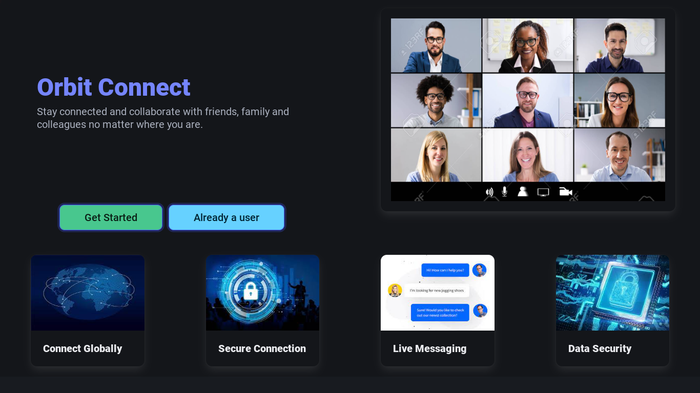
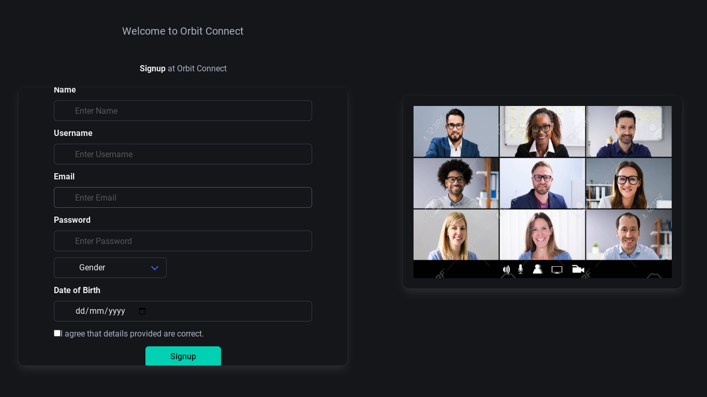

<h1 align="center" id="title">Orbit Connect</h1>

<p id="description">Orbit Connect is a Social Media web app where user can live chat between friends and post their thoughts. Add new friend and interact with them and share thoughts.</p>

<p align="center"></p>

<h2>Project Screenshots:</h2>





  
  
<h2>🧐 Features</h2>

Here're some of the project's best features:

*   Live messaging
*   Sharing thoughts with friends
*   Primary level of privacy
*   Track social activity
*   Efficient user search

<h2>🛠️ Installation Steps (Linux):</h2>

<p>1. Installing the client packages</p>

```
cd client && npm i
```

<p>2. installing server packages</p>

```
cd server && npm i
```

<p>3. setup database</p>

```
cd /path/to/orbit\ connect/dbSetup && mysql -u username -p database_name < database.sql
```

<p>4. starting the app on localhost</p>

```
cd client && npm run dev
```

<p>5. starting server</p>

```
cd server && npm start
```

<h2>🍰 Contribution Guidelines:</h2>

We welcome contributions to this project! If you're interested in contributing please feel free to check the existing issues or identify new ones. Your help is greatly appreciated.

  
  
<h2>💻 Built with</h2>

Technologies used in the project:

*   React Js
*   Nodejs
*   Express js
*   Socket.io
*   Socket.io-client
*   MySQL Database
*   Nodemailer Bcrypt js etc.

<h2>🛡️ License:</h2>

This project is licensed under the Mozilla Public License Version 2.0
